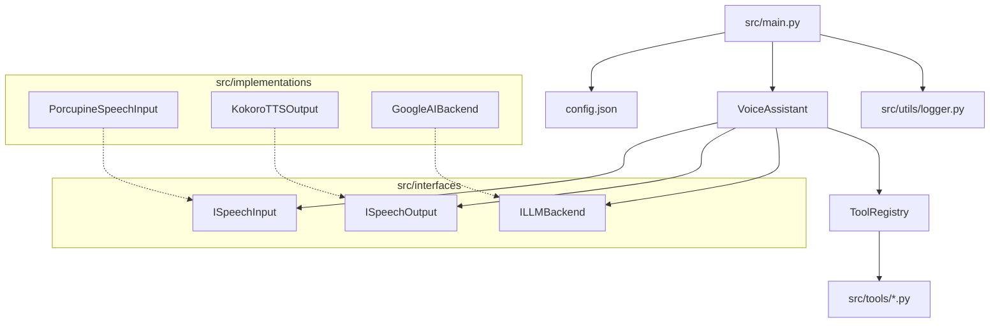

# Miyori Architecture

> [!NOTE]
> This is a living document. It describes the system as it exists and the conventions for extending it.

## System Overview

Miyori is a modular voice assistant built in Python. The system follows a clean "Interface -> Implementation" pattern, orchestrated by a central assistant loop.

### Core Components

1.  **Assistant (`src/core/assistant.py`)**: The main loop. It listens for input, checks for exit commands, and streams input to the LLM backend while handling TTS output chunks.
2.  **Interfaces (`src/interfaces/`)**: Abstract Base Classes (ABCs) that define the contract for speech input, speech output, and LLM backends.
3.  **Implementations (`src/implementations/`)**: Concrete classes that fulfill the interfaces. Each implementation is isolated in its own sub-package.
4.  **Logging (`src/utils/logger.py`)**: A utility that redirects `stdout` and `stderr` to both the terminal and rotating log files in the `/logs` directory.
5.  **Configuration (`config.json`)**: A single JSON file at the project root that holds all settings (API keys, thresholds, rates, tool settings).

## Code Conventions

-   **Interfaces First**: All major components must implement an interface defined in `src/interfaces/`.
-   **Configuration**: Do not hardcode constants. Read from `config.json`.
-   **Type Hinting**: Use full Python type hints for all method signatures.
-   **Logging**: Use `print()` for console output. The logging system automatically captures this into log files.
-   **Tools**: Tools do NOT use the interface/implementation pattern. They are simple functions registered with the `ToolRegistry`.
-   **Error Handling**: Let exceptions bubble up unless specifically handling a known recoverable state.

## Tools Architecture

Unlike the core components, tools are designed for simplicity. They are standalone functions that register themselves with a central `ToolRegistry`.

- **Registry (`src/core/tool_registry.py`)**: Manages the discovery and execution of tools.
- **Definitions (`src/core/tools.py`)**: Data classes that define the schema (name, description, parameters) that the LLM uses to understand when to call a tool.
- **Implementations (`src/tools/`)**: Modular Python files (e.g., `web_search.py`) containing the actual logic.

## Key Design Decisions

### Streaming-First Architecture
To minimize latency, the system is designed for streaming. The `ILLMBackend.generate_stream` method takes a callback `on_chunk`. The assistant passes a callback that immediately sends text chunks to the TTS engine (`ISpeechOutput.speak`).

### Dependency Injection
The `VoiceAssistant` class does not instantiate its dependencies. They are passed in via the constructor in `src/main.py`. This allows for easy swapping of implementations (e.g., testing vs. production).

## Extension Points

### Adding a New Capability
To replace a component (e.g., swapping Google Speech for Whisper):
1.  Create a new directory in `src/implementations/speech/whisper/`.
2.  Create a class that implements `ISpeechInput`.
3.  Add necessary config keys to `config.json`.
4.  Update `src/main.py` to instantiate your new class and pass it to the assistant.
The same pattern applies for:
   - `ISpeechInput` in `src/implementations/speech/`
   - `ISpeechOutput` in `src/implementations/tts/`
   - `ILLMBackend` in `src/implementations/llm/`

## Feature Planning Workflow

We use a transient documentation pattern for planning features.

1.  **Create Plan**: When starting a feature, create `FEATURE_[feature_name].md` in the root.
    -   Outline requirements.
    -   Draft valid code snippets or architecture changes.
2.  **Implement**: Refer to the feature file during coding.
3.  **Cleanup**: **Delete** the `FEATURE_*.md` file when the feature is fully implemented and verified.
4.  **Update**: If architectural changes were made, update this `ARCHITECTURE.md` file.