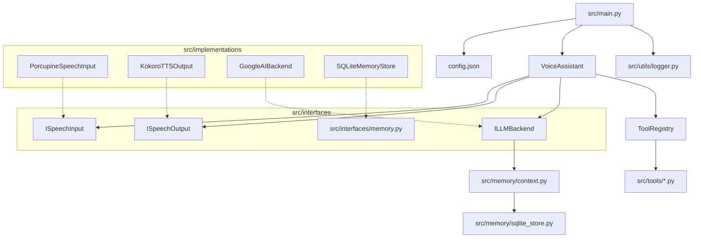

# Miyori Architecture

> [!NOTE]
> This is a living document. It describes the system as it exists and the conventions for extending it.

## System Overview

Miyori is a modular voice assistant built in Python. The system follows a clean "Interface -> Implementation" pattern, orchestrated by a central assistant loop.

### Core Components

* **Assistant (`src/core/assistant.py`)**: The main loop that orchestrates the system, listening for input and streaming results to the LLM and TTS engines.
* **Memory System (`src/memory/`)**: A four-tier cognitive architecture (Episodic, Semantic, Relational, Emotional) that allows for long-term behavioral consistency.
* **Interfaces (`src/interfaces/`)**: Abstract Base Classes (ABCs) that define the contractual requirements for speech input, output, and LLM backends.
* **Implementations (`src/implementations/`)**: Concrete classes, isolated in sub-packages, that fulfill the defined interfaces.
* **Logging (`src/utils/logger.py`)**: A utility redirecting `stdout`/`stderr` to capture all console output into terminal and rotating log files.
* **Configuration (`config.json`)**: The central JSON file at the project root holding all system settings.

---

## Memory Architecture

Miyori uses a human-like memory system designed for behavioral consistency rather than eidetic recall. It utilizes an abstracted memory store for structured data and vector embeddings for semantic retrieval.

### Four-Tier Storage
* **Episodic**: Summarized past conversations with emotional valence and importance scores.
* **Semantic**: Distilled facts (e.g., "User works as an engineer") with confidence levels and version history.
* **Relational**: High-level interaction norms, communication styles, and relationship phases.
* **Emotional Thread**: Tracks current mood and continuity across recent interactions.

### Processing Pipeline
* **Write Gate**: Only stores data meeting specific criteria such as explicit requests, high emotion, or identity-defining facts.
* **Async Embedding Queue**: Summaries are generated via LLM and queued for background processing to prevent TTS latency. 
* **Prioritized Retrieval**: Context is built using a strict 1000-token budget with the following priority: Relational > Emotional > Recent Important > Semantic Facts > Relevant Episodic.
* **Consolidation**: A periodic background task clusters related episodes to extract stable facts and prunes the database to stay within memory budgets.

---

## Code Conventions

* **Interfaces First**: All major components must implement an interface in `src/interfaces/`.
* **Configuration**: Do not hardcode constants; read from `config.json`.
* **Type Hinting**: Use full Python type hints for all method signatures.
* **Logging**: Use `print()` for console output; the logger captures these automatically.
* **Tools**: Standalone functions registered with the `ToolRegistry`.
* **Async Safety**: Background tasks like memory processing must not block the main assistant loop.

## Key Design Decisions

### Streaming-First Architecture
To minimize latency, `ILLMBackend.generate_stream` uses a callback to feed text chunks immediately to the TTS engine.

### Dependency Injection
`VoiceAssistant` dependencies are passed via the constructor in `src/main.py` to allow easy swapping of implementations.

## Extension Points

### Adding a New Capability
To replace a component:
1.  Create a class in `src/implementations/` that fulfills the relevant interface.
2.  Add required config keys to `config.json`.
3.  Instantiate and inject the new class in `src/main.py`.

---

## Feature Planning Workflow
1.  **Create Plan**: Draft `FEATURE_[name].md` for requirements and architecture.
2.  **Implement**: Follow the plan and refer to this doc for conventions.
3.  **Cleanup**: Delete the `FEATURE_*.md` file once the feature is verified.
4.  **Update**: Revise this `ARCHITECTURE.md` if structural changes were made.