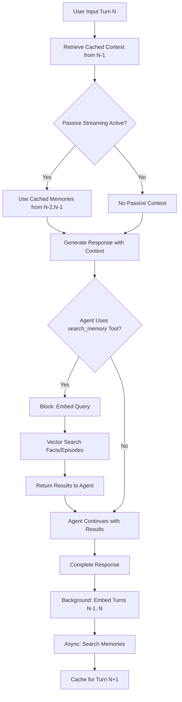
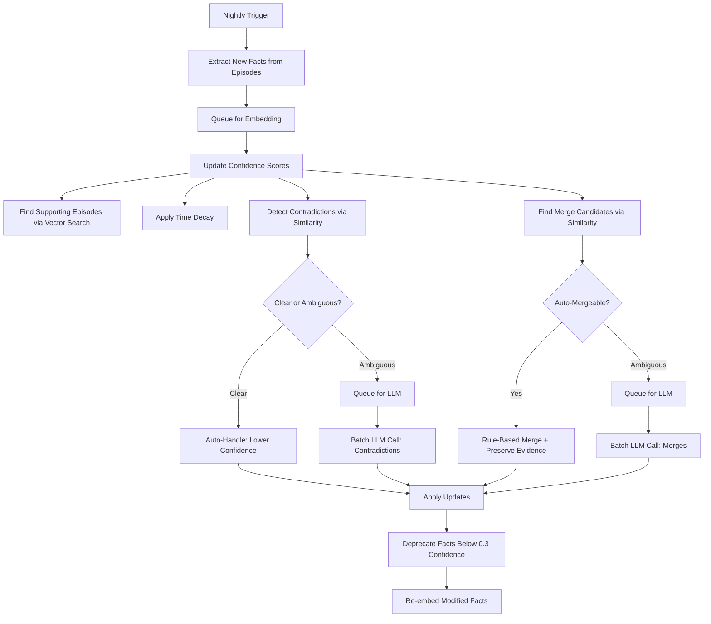

# Semantic Fact System: Architectural Plan

## Current State Assessment

- **EXTRACTION:** ✅ Working satisfactorily via HDBSCAN clustering
- **EMBEDDING:** ✅ Implemented
- **RECALL:** ✅ Implemented
- **MANAGING:** ❌ No confidence update system
- **MERGING:** ❌ Many duplicate/related facts accumulating

---

## Core Philosophy: Dual-Mode Retrieval + Batch Maintenance

**Principle:** Memories flow naturally (passive streaming) AND can be explicitly queried (active tools). Heavy operations run in nightly consolidation. LLM calls are batched and reserved for ambiguous cases only.

---

## System Architecture

### 1. EMBEDDING: Async Queue Pattern

**Flow:**
```
New Fact → DB (status='pending_embed') 
         → Background Queue 
         → Gemini text-embedding-004 
         → DB (status='active')
```

**Key Points:**
- Mirrors proven episodic embedding pattern exactly
- Non-blocking—facts queryable immediately via text fallback
- Background worker processes queue continuously
- Facts become searchable as soon as embedding completes

**API Cost:** ~0.0001¢ per fact (negligible)

---

### 2. RECALL: Dual-Mode Retrieval Architecture

The system supports TWO distinct retrieval modes:

#### Mode A: Passive Streaming (Async Context Flow)

**Purpose:** Natural memory recall based on conversational context

**Flow:**
```
Conversation Turn N-2, N-1 → Background Thread
                           → Generate Context Embedding (async)
                           → Vector Search Facts + Episodes
                           → Stream into Context Buffer
                           → Available for Turn N response
```

**Key Characteristics:**
- **Non-blocking:** Search happens while user types or during response generation
- **Context-based:** Uses previous turns (N-2, N-1), NOT current user input
- **Automatic:** No explicit agent decision required
- **Budget-aware:** Fills available context space up to reserved allocation

**Implementation:**
```python
# Pseudocode in response pipeline
async def handle_turn(user_input):
    # 1. Start async memory retrieval for NEXT turn
    context_window = get_recent_turns(count=2)
    memory_task = asyncio.create_task(
        retrieve_memories_async(context_window)
    )
    
    # 2. Process current turn with existing context
    response = await generate_response(user_input, current_context)
    
    # 3. Await memory results for next turn's context
    streamed_memories = await memory_task
    cache_for_next_turn(streamed_memories)
    
    return response
```

**What Gets Streamed:**
- Top 3-5 facts (diversity sampled)
- Top 3-5 episodes (if relevant)
- Sorted by: `relevance_score = similarity * 0.6 + confidence * 0.3 + recency * 0.1`

#### Mode B: Active Tool-Based Search (Blocking Query)

**Purpose:** Explicit memory lookup by agent when needed

**Tool Signature:**
```python
@tool
def search_memory(
    query: str,
    search_type: Literal["facts", "episodes", "both"] = "both",
    limit: int = 5
) -> List[Memory]:
    """
    Search semantic facts and/or episodic memories.
    
    Args:
        query: Natural language search query
        search_type: What to search
        limit: Max results to return
    
    Returns:
        List of Memory objects with text, confidence, timestamp
    """
```

**Flow:**
```
Agent decides to search → Tool call: search_memory("user's work projects")
                       → Generate Query Embedding (BLOCKING)
                       → Vector Search + Symbolic Filter
                       → Diversity Sample results
                       → Return to Agent
                       → Agent reasons with results
```

**Key Characteristics:**
- **Blocking:** Embedding + search completes before agent continues
- **Explicit:** Agent must decide to use the tool
- **Precise:** Agent controls query and search scope
- **Separate budget:** Tool results don't compete with streamed context

**Use Cases:**
- "What did I say about X last month?"
- "Do I have any memories about Y?"
- Resolving factual uncertainty mid-conversation

#### Hybrid Retrieval Process (Both Modes)

**Shared Components:**

1. **Vector Search** (Top 20 candidates)
   ```python
   candidates = vector_search(
       query_embedding=embedding,
       table="semantic_memory",
       filters={"status": "active", "confidence": ">0.5"},
       limit=20
   )
   ```

2. **Symbolic Filtering**
   - Confidence threshold: `> 0.5` for passive, `> 0.3` for active tool
   - Status: Only `active` facts
   - Recency weighting (decay applied)

3. **Diversity Sampling**
   ```python
   # Cluster by similarity
   clusters = cluster_by_embedding(candidates, threshold=0.8)
   
   # Take top from each cluster
   diverse_results = []
   for cluster in clusters:
       best = max(cluster, key=lambda x: x.confidence)
       diverse_results.append(best)
       if len(diverse_results) >= limit:
           break
   ```

**API Cost:** 
- Passive: ~$0.0001 per turn (single context embedding)
- Active: ~$0.0001 per tool call (single query embedding)

---

### 3. MANAGING CONFIDENCE: Evidence-Based Updates

**Runs During:** Nightly consolidation via `run_consolidation.py`

**Rule-Based Confidence Updates (No LLM):**

```python
# Pseudocode
confidence_new = confidence_old * factors

factors = [
    evidence_accumulation(),  # New supporting episodes found
    time_decay(),             # Reduce if no recent reinforcement
    contradiction_penalty(),  # Lower if conflicted (clear cases only)
]
```

**Evidence Accumulation:**
```python
# Find episodes similar to this fact
supporting_episodes = vector_search(
    query_embedding=fact.embedding,
    table="episodic_memory",
    threshold=0.75,
    filters={"timestamp": ">= fact.last_updated"}
)

# Asymptotic confidence growth
for episode in supporting_episodes:
    confidence += 0.05 * (1 - confidence)
    fact.derived_from.append(episode.id)
```

**Time Decay:**
```python
days_since_evidence = (now - fact.last_updated).days
confidence *= exp(-days * 0.01)  # ~10% decay per 10 days
```

**Contradiction Handling:**
- **Clear contradictions** (cosine_similarity > 0.85, opposite valence): 
  - Reduce both facts' confidence by 50%
  - Flag for LLM resolution
- **Ambiguous conflicts**: Queue for batched LLM judgment

**Confidence Thresholds:**
- `< 0.3`: Auto-deprecate (`status='deprecated'`, excluded from all retrieval)
- `0.3 - 0.5`: Excluded from passive streaming, available in tool searches
- `> 0.5`: Full participation in both retrieval modes

**LLM Batch Call:** Resolve flagged contradictions in single API call per consolidation

---

### 4. MERGING: Deduplication with Evidence Preservation

**Runs During:** Nightly consolidation via `run_consolidation.py`

**Three-Stage Process:**

#### Stage 1: Find Candidates (Free)
```python
# For all active facts
similarity_matrix = cosine_similarity(all_fact_embeddings)
candidates = find_pairs(similarity_matrix, threshold=0.85)
clusters = group_connected_components(candidates)
```

#### Stage 2: Rule-Based Auto-Merge (No LLM)
```python
for cluster in clusters:
    if is_auto_mergeable(cluster):
        # Keep highest confidence fact
        winner = max(cluster, key=lambda f: f.confidence)
        
        # Merge evidence lineage
        winner.derived_from = union([f.derived_from for f in cluster])
        winner.evidence_count = sum([f.evidence_count for f in cluster])
        winner.last_updated = now()
        
        # Archive losers with pointer
        for loser in cluster - {winner}:
            loser.status = 'merged_into'
            loser.merged_into_id = winner.id
            loser.archived_at = now()
```

**Auto-Merge Criteria:**
- Cosine similarity > 0.85
- Same category (if categorized)
- No contradiction detected (similar confidence, no opposite meaning)
- At least one fact has confidence > 0.6

#### Stage 3: LLM Validation (Ambiguous Cases Only)
```python
ambiguous_clusters = [
    c for c in clusters 
    if has_potential_contradiction(c) or low_confidence_cluster(c)
]

# Single batched LLM call
prompt = f"""
For each cluster of similar facts, decide: MERGE, KEEP_BOTH, or CONTRADICTION

Cluster 1:
- "User is a backend developer" (conf: 0.9)
- "User works in frontend" (conf: 0.7)

Cluster 2:
- "User likes coffee" (conf: 0.8)
- "User drinks coffee daily" (conf: 0.6)
...
"""

decisions = llm_batch_decide(prompt)
apply_merge_decisions(decisions)
```

**API Cost:** 1-2 batched calls per consolidation cycle

---

### 5. INTEGRATION: Complete System Flow

#### At Runtime (Every Conversation Turn):



#### At Consolidation (Nightly via `run_consolidation.py`):



---

### 6. Context Budget Architecture

**Problem:** Current 1000-token flat budget is insufficient for dual-mode system.

**Proposed Budget Allocation:**

| Context Tier | Token Budget | Source | Priority |
|--------------|--------------|--------|----------|
| Recent Messages | 300-500 tokens | Last 3-5 conversation turns | REQUIRED |
| Active Tool Results | Up to 400 tokens | `search_memory` tool returns | HIGH (if used) |
| Streamed Facts | 100-200 tokens | Passive retrieval (semantic) | MEDIUM |
| Streamed Episodes | 100-200 tokens | Passive retrieval (episodic) | MEDIUM |
| System Instructions | Remaining | Personality, style | FILL |

**Budget Enforcement Rules:**
1. **Recent messages always fit** - they get first claim on budget
2. **Tool results are privileged** - if agent explicitly searched, results must be included
3. **Streaming is opportunistic** - fills remaining space, dropped gracefully if needed
4. **Hard limit:** 1500 tokens total (expandable in config)

**Implementation:**
```python
def build_context(recent_msgs, tool_results, streamed_memories, system):
    budget = 1500
    context = []
    
    # 1. Recent messages (required)
    recent_tokens = count_tokens(recent_msgs)
    context.append(recent_msgs)
    budget -= recent_tokens
    
    # 2. Tool results (if present)
    if tool_results:
        tool_tokens = count_tokens(tool_results)
        if tool_tokens <= budget:
            context.append(tool_results)
            budget -= tool_tokens
    
    # 3. Streamed memories (opportunistic)
    for memory in streamed_memories:
        mem_tokens = count_tokens(memory)
        if mem_tokens <= budget:
            context.append(memory)
            budget -= mem_tokens
        else:
            break  # Stop when budget exhausted
    
    # 4. System (fills remaining)
    context.append(truncate(system, max_tokens=budget))
    
    return context
```

---

## Cost Analysis

**Assumptions:**
- 500 facts at steady state
- 100 conversation turns/week
- 50 new episodes/week → ~5-10 new facts/week
- Weekly consolidation
- 10% of turns use `search_memory` tool

**Per Week:**

| Operation | LLM Calls | Estimated Cost |
|-----------|-----------|----------------|
| Embed new facts (5-10) | 0 | ~$0.001 |
| Passive context embeddings (100 turns) | 0 | ~$0.01 |
| Active tool embeddings (10 searches) | 0 | ~$0.001 |
| Merge ambiguous clusters (2-3) | 1 batch | ~$0.02 |
| Resolve contradictions (1-2) | 1 batch | ~$0.02 |
| **Total per week** | **~2 LLM calls** | **~$0.052** |

**Note:** Embedding costs are negligible (~$0.00001 per embedding). Main cost is LLM reasoning during consolidation.

---

## Key Design Decisions

### Dual-Mode Retrieval
- **Passive streaming** for natural flow (lagging by 1-2 turns)
- **Active tool** for explicit queries (blocking but precise)
- Both use same underlying search infrastructure
- Separate budget allocations prevent interference

### Merging Strategy
- **Highest confidence fact wins** as canonical version
- **Evidence lineage preserved:** Merge all `derived_from` arrays
- **Losers archived** with `merged_into_id` pointer for traceability
- **Never delete:** Merged facts stay in DB with status change

### Confidence Management
- **Rule-based by default:** 90% of updates need no LLM
- **Asymptotic growth:** Prevents runaway confidence from many weak signals
- **Deprecation threshold:** Facts below 0.3 excluded from passive retrieval
- **Tool access to low-confidence:** Allows explicit querying of uncertain facts

### Contradiction Handling
- **Clear contradictions:** Handled automatically (reduce both confidences)
- **Ambiguous conflicts:** Batched LLM resolution once per cycle
- **Context-dependent facts:** System can keep both if LLM determines validity

### Context Budget
- **Recent messages get priority:** Conversational flow is sacred
- **Tool results are privileged:** Explicit agent queries must be answered
- **Streaming is best-effort:** Graceful degradation when budget tight
- **Expandable:** Config-driven limits, not hardcoded

---

## Implementation Priority

### Phase 1: Core Infrastructure (Week 1)
1. **Fact Embedding Queue**
   - Add `status` field to semantic_memory table
   - Implement async embedding queue (mirror episodic pattern)
   - Background worker to process queue

2. **Shared Search Infrastructure**
   - Vector search function for both facts and episodes
   - Symbolic filtering by confidence/status
   - Diversity sampling via cosine clustering

### Phase 2: Tool-Based Recall (Week 1-2)
3. **Memory Search Tool**
   - Define tool signature and schema
   - Implement blocking search function
   - Integration with agent tooling system
   - Add separate budget allocation for tool results

### Phase 3: Passive Streaming (Week 2)
4. **Async Context Retrieval**
   - Background thread for context embedding
   - Async vector search while generating response
   - Caching mechanism for next-turn context
   - Budget-aware memory injection

### Phase 4: Confidence Management (Week 2-3)
5. **Rule-Based Updates**
   - Evidence accumulation via vector search
   - Time decay calculation
   - Auto-deprecation for low confidence
   - Supporting episode finder

### Phase 5: Merging (Week 3)
6. **Deduplication System**
   - Pairwise similarity detection
   - Rule-based auto-merge for clear cases
   - Merge candidate queue for ambiguous cases
   - Evidence lineage preservation

### Phase 6: LLM Validation (Week 4)
7. **Batch Resolution**
   - Contradiction resolution prompts
   - Merge decision prompts
   - Integration into `run_consolidation.py`
   - Error handling and fallbacks

---

## Success Metrics

### Retrieval Quality
- **Passive relevance:** % of streamed memories cited in responses
- **Tool effectiveness:** % of tool searches that resolve agent's question
- **Diversity score:** Measure redundancy in retrieved facts
- **Latency:** Passive streaming should add <100ms to turn processing

### Maintenance Quality
- **Deduplication rate:** % of duplicate facts successfully merged per cycle
- **Confidence accuracy:** Correlation between confidence and supporting evidence
- **Deprecation rate:** % of facts that naturally decay vs. get reinforced
- **Contradiction resolution:** % resolved automatically vs. requiring LLM

### Cost Efficiency
- **Stay under $0.10/week** for all consolidation operations
- **Embedding costs negligible** (<$0.02/week)
- **Tool usage tracking:** Monitor frequency and optimize if excessive

### User Experience
- **Response quality:** User feedback on factual accuracy
- **Memory relevance:** A/B test passive streaming on/off
- **Tool adoption:** Track agent's search_memory usage patterns