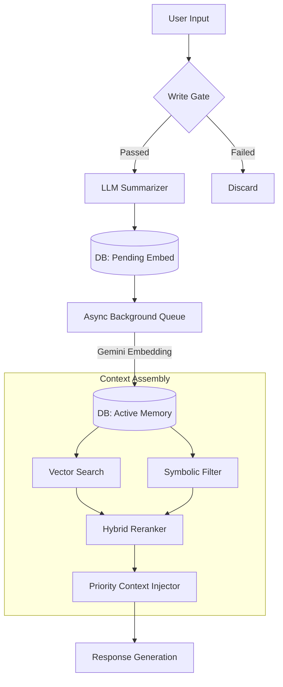

# Human-Like Memory System: Technical Documentation

## 1. System Overview & Philosophy

This document details the architecture and implementation of the currently deployed Human-Like Memory System. The system distinguishes itself from standard vector stores by implementing a **lossy, narrative-driven architecture** optimized for behavioral consistency rather than perfect recall.

### Core Architecture Principles
1.  **Narrative Editing:** The system actively summarizes, compresses, and forgets information to maintain a coherent identity, rather than functioning as a static log.
2.  **Four-Tier Hierarchy:** Data flows from raw experience (Episodic) to distilled knowledge (Semantic) to core personality (Relational).
3.  **Strict Context Budget:** Response generation respects a strict token limit, prioritizing immediate emotional context and personality over older facts.

---

## 2. Architecture & Data Flow

The system operates on a "Check-In / Background Process / Check-Out" lifecycle.

### High-Level Data Flow

---

## 3. Storage Layer (Schema)

The system uses **SQLite** with a production-ready schema designed for transaction safety and complex JSON structures.

### 3.1 Episodic Memory (`episodic_memory`)
Stores specific conversations and events. This is the entry point for all new information.

| Field | Type | Description |
| :--- | :--- | :--- |
| `id` | UUID | Primary Key. |
| `timestamp` | DATETIME | Interaction time. |
| `full_text` | JSON | Raw exchange (User/Miyori). |
| `summary` | TEXT | LLM-condensed summary (100-150 tokens). |
| `embedding` | BLOB | 768-dim vector (Gemini `text-embedding-004`). |
| `importance` | REAL | 0.0-1.0 score (Emotion + Utility). |
| `emotional_valence` | REAL | -1.0 (Negative) to +1.0 (Positive). |
| `status` | TEXT | `pending_embedding` \| `active` \| `archived`. |

**Implementation Note:** Rows are initially inserted with `status='pending_embedding'`. The retrieval system filters specifically for `status='active'` to prevent race conditions.

### 3.2 Semantic Memory (`semantic_memory`)
Stores facts distilled from multiple episodes.

| Field | Type | Description |
| :--- | :--- | :--- |
| `fact` | TEXT | Atomic information (e.g., "User is a dev"). |
| `confidence` | REAL | 0.0-1.0 stability score. |
| `version_history` | JSON | Tracked changes to facts over time. |
| `derived_from` | JSON | Source Episodic UUIDs. |
| `contradictions` | JSON | UUIDs of conflicting memories. |
| `status` | TEXT | `tentative` \| `stable` \| `deprecated`. |

### 3.3 Relational Memory (`relational_memory`)
Stores interaction norms and personality baselines.

| Field | Type | Description |
| :--- | :--- | :--- |
| `category` | TEXT | e.g., `communication_style`, `preferences`. |
| `data` | JSON | Norm definitions and weights. |
| `evidence_count` | INT | Number of interactions supporting this norm. |

---

## 4. The Intelligence Lifecycle (Write Path)

### 4.1 Memory Write Gate
To prevent noise, the system filters inputs via `should_remember()`. An interaction is stored only if it meets specific criteria:
* **Explicit Request:** User says "remember this".
* **High Emotion:** Valence > 0.6.
* **Relational Damage:** Forgetting would hurt the relationship.
* **Decision Made:** User committed to an action.

### 4.2 Async Embedding Queue
Implemented in `src/memory/episodic.py` to ensure TTS/Response latency is not affected by embedding generation:
1.  **Immediate Write:** Episode stored as `pending_embedding`.
2.  **Queue:** ID pushed to `asyncio.Queue`.
3.  **Process:** Background worker generates embedding via Gemini `text-embedding-004`.
4.  **Activation:** DB updated to `status='active'` on success.

### 4.3 Importance Scoring & Decay
Importance is calculated at write-time and decays dynamically:
$$Score = Base + Emotion(0.3) + Personal(0.2) + Decision(0.2)$$
$$Decay = Score \times e^{\frac{-AgeDays \times \ln(2)}{HalfLife}}$$
*Note: High importance memories have a longer half-life*.

---

## 5. Context Assembly (Read Path)

The system constructs a context window using a prioritized budget of **1000 tokens**.

### 5.1 Hybrid Retrieval & Reranking
Candidates are fetched via vector search (top 20) and then reranked using symbolic logic:
`Relevance = (Similarity * 0.5) + (Importance * 0.3) + (Recency * 0.2)`.

### 5.2 Priority Injection Hierarchy
The `build_context()` function injects data in strict order. If the 1000-token limit is hit, lower tiers are dropped completely (never mid-sentence).

1.  **RELATIONAL (Personality/Style)** [REQUIRED]
    * *Source:* `relational_memory`
2.  **EMOTIONAL (Current Thread)** [REQUIRED]
    * *Source:* `emotional_thread`
3.  **RECENT (Last 7 days, High Importance)** [HIGH]
    * *Source:* `episodic_memory` (Recent)
4.  **FACTS (Semantic Knowledge)** [MEDIUM]
    * *Source:* `semantic_memory`
5.  **RELEVANT (Retrieval Results)** [FILL]
    * *Source:* `episodic_memory` (Vector match)

---

## 6. Background Maintenance Processes

### 6.1 Consolidation
Running nightly (or per 50 episodes), this process clusters episodic memories. If a fact appears in multiple clusters/episodes, it is extracted and promoted to **Semantic Memory**.

### 6.2 Conflict Resolution & Passive Confirmation
The system detects if a new memory conflicts with a semantic fact.
* If `new_timestamp > last_confirmed`, the old fact's confidence is lowered.
* If the conflict is high-importance, a "Passive Confirmation" is flagged, prompting the system to ask the user naturally in the next conversation.

### 6.3 Budget Enforcement
Hard limits are enforced via `config.json` settings:
* **Episodic Cap:** 1000 Active items.
* **Semantic Cap:** 500 Facts.
* **Pruning Strategy:** When over budget, the system archives the oldest, lowest-importance items first.

---

## 7. Testing & Verification

The system is verified via the following suite:

* **`tests/test_embedding_queue.py`:** Confirms episodes transition from `pending` to `active` without blocking the main thread.
* **`tests/test_context_budget.py`:** Ensures the priority ordering (Relational > ... > Relevant) strictly respects the 1000-token limit.
* **`tests/test_summarization.py`:** Validates that LLM summaries retain key entities compared to raw text.