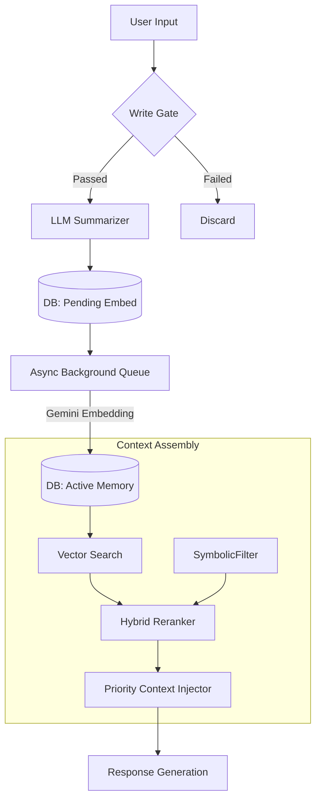

# Human-Like Memory System: Technical Documentation

## 1. System Overview & Philosophy

This document details the architecture and implementation of the currently deployed Human-Like Memory System. The system distinguishes itself from standard vector stores by implementing a **lossy, narrative-driven architecture** optimized for behavioral consistency rather than perfect recall.

### Core Architecture Principles
**Narrative Editing:** The system actively summarizes, compresses, and forgets information to maintain a coherent identity, rather than functioning as a static log.
**Real-Time Responsiveness:** All memory operations must be non-blocking. The async embedding queue ensures that remembering never delays response generation or TTS—the conversational experience takes absolute priority
**Living Knowledge Base:**
The system actively manages contradictions, updates confidence scores, and triggers passive confirmations. Memory isn't static storage—it's a reasoner that adapts to new information.

---

## 2. Architecture & Data Flow

The system operates on a "Check-In / Background Process / Check-Out" lifecycle.

### High-Level Data Flow

---

## 3. Storage Layer (Schema)

The system uses a db interface `src/interfaces/memory.py` currently implemented with **SQLite** `src/memory/sqlite_store`.

### 3.1 Episodic Memory (`episodic_memory`)
Stores specific conversations and events. This is the entry point for all new information. Episodes are summarised by `src/memory/summarizer.py`

| Field | Type | Description |
| :--- | :--- | :--- |
| `id` | UUID | Primary Key. |
| `timestamp` | DATETIME | Interaction time. |
| `full_text` | JSON | Raw exchange (User/Miyori). |
| `summary` | TEXT | LLM-condensed summary (100-150 tokens). |
| `embedding` | BLOB | 768-dim vector (Gemini `text-embedding-004`). |
| `importance` | REAL | 0.0-1.0 score. |
| `consolidated_at` | DATETIME | Fact extraction time. |
| `status` | TEXT | `pending_embedding` \| `active` \| `archived`. |

**Implementation Note:** Rows are initially inserted with `status='pending_embedding'`. The retrieval system filters specifically for `status='active'` to prevent race conditions.

### 3.2 Semantic Memory (`semantic_memory`)
Stores facts distilled from multiple episodes.

| Field | Type | Description |
| :--- | :--- | :--- |
| `fact` | TEXT | Atomic information (e.g., "User is a dev"). |
| `confidence` | REAL | 0.0-1.0 stability score. |
| `version_history` | JSON | Tracked changes to facts over time. |
| `derived_from` | JSON | Source Episodic UUIDs. |
| `contradictions` | JSON | UUIDs of conflicting memories. |
| `status` | TEXT | `tentative` \| `stable` \| `deprecated`. |

---

## 4. The Intelligence Lifecycle (Write Path)

### 4.1 Memory Write Gate
**[ISSUE:] Documentation missing or ambiguous. An LLM handles write gating in current implementation.**

To prevent noise, the system filters inputs via `should_remember()` in `src/memory/gates.py`. An interaction is stored only if it meets specific criteria:
* **Explicit Request:** User says "remember this".
* **Relational Damage:** Forgetting would hurt the relationship.
* **Decision Made:** User committed to an action.

### 4.2 Async Embedding Queue
Implemented in `src/memory/episodic.py` (`EmbeddingQueue` class) to ensure TTS/Response latency is not affected by embedding generation:
1.  **Immediate Write:** Episode stored as `pending_embedding`.
2.  **Queue:** ID pushed to `asyncio.Queue`.
3.  **Process:** Background worker generates embedding via Gemini `text-embedding-004`.
4.  **Activation:** DB updated to `status='active'` on success.

### 4.3 Importance Scoring & Decay
**[ISSUE:] Current scoring is placeholder with arbitrary static weights that are very naively detected**

Importance is calculated at write-time in `src/memory/scoring.py` (`ImportanceScorer` class) and decays dynamically:
$$Score = Base + Emotion(0.3) + Personal(0.2) + Decision(0.2)$$
$$Decay = Score \times e^{\frac{-AgeDays \times \ln(2)}{HalfLife}}$$
*Note: High importance memories have a longer half-life*.

---

## 5. Context Assembly (Read Path)

The system constructs a context window using a prioritized token budget.

### 5.1 Hybrid Retrieval & Reranking
Candidates are fetched via vector search (top 20) in `src/memory/episodic.py` (`EpisodicMemoryManager.retrieve_relevant()`) and then reranked using symbolic logic:
`Relevance = (Similarity * 0.5) + (Importance * 0.3) + (Recency * 0.2)`.

### 5.2 Priority Injection Hierarchy
The `build_context()` function in `src/memory/context.py` (`ContextBuilder` class) injects data in strict order. If the 1000-token limit is hit, lower tiers are dropped completely (never mid-sentence).

**[ISSUE:] We need a different approach to budget handling. Recent messages should have their own budget. We should always be able to afford relevant facts and memories.**
1.  **RECENT (Last 7 days, High Importance)** [HIGH]
    * *Source:* `episodic_memory` (Recent)
2.  **FACTS (Semantic Knowledge)** [MEDIUM]
    * *Source:* `semantic_memory`
3.  **RELEVANT (Retrieval Results)** [FILL]
    * *Source:* `episodic_memory` (Vector match)

---

## 6. Background Maintenance Processes

### 6.1 Consolidation
Running nightly (or per 50 episodes) in `src/memory/consolidation.py` (`ConsolidationManager` class), this process clusters episodic memories. If a fact appears in multiple clusters/episodes, it is extracted and promoted to **Semantic Memory** in `src\memory\deep_layers.py`.

### 6.2 Conflict Resolution
The system detects if a new memory conflicts with a semantic fact in `src/memory/consolidation.py` (`ContradictionDetector` class).
* If `new_timestamp > last_confirmed`, the old fact's confidence is lowered.

### 6.3 Budget Enforcement
Hard limits are enforced via `config.json` settings in `src/memory/budget.py` (`MemoryBudget` class):
* **Episodic Cap:** 1000 Active items.
* **Semantic Cap:** 500 Facts.
* **Pruning Strategy:** When over budget, the system archives the oldest, lowest-importance items first.