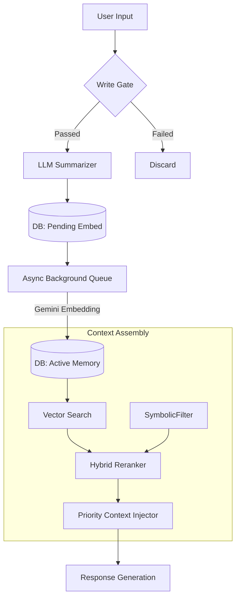
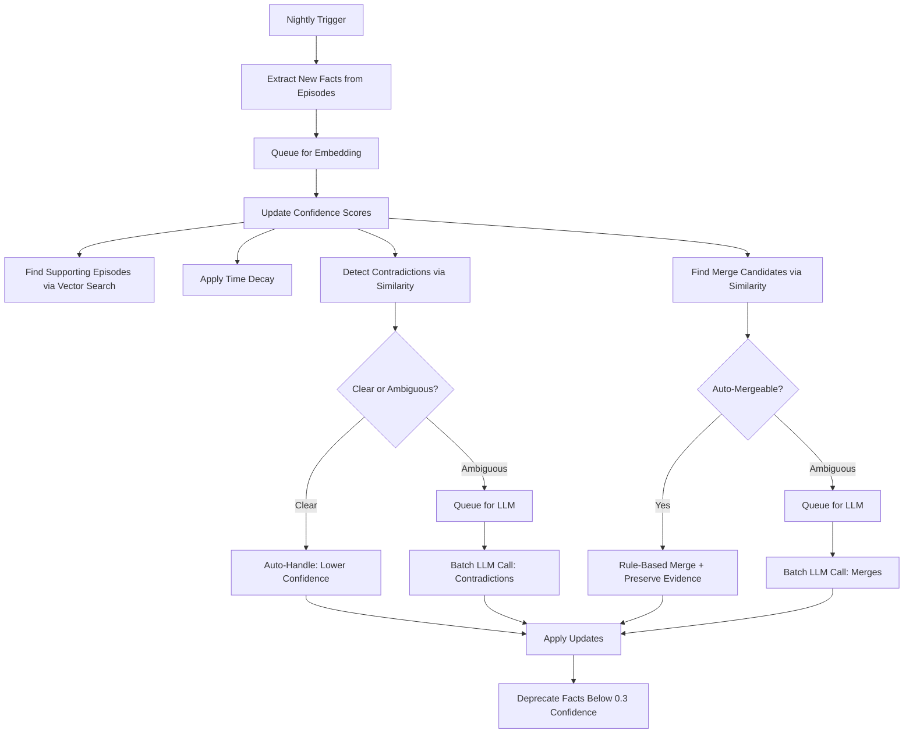

# Human-Like Memory System: Technical Documentation

## 1. System Overview & Philosophy

This document details the architecture and implementation of the currently deployed Human-Like Memory System. The system distinguishes itself from standard vector stores by implementing a **lossy, narrative-driven architecture** optimized for behavioral consistency rather than perfect recall.

### Core Architecture Principles
**Narrative Editing:** The system actively summarizes, compresses, and forgets information to maintain a coherent identity, rather than functioning as a static log.
**Real-Time Responsiveness:** All memory operations must be non-blocking. The async embedding queue ensures that remembering never delays response generation or TTS—the conversational experience takes absolute priority
**Living Knowledge Base:**
The system actively manages contradictions, updates confidence scores, and triggers passive confirmations. Memory isn't static storage—it's a reasoner that adapts to new information.

---

## 2. Architecture & Data Flow

The system operates on a "Check-In / Background Process / Check-Out" lifecycle.

### High-Level Data Flow

---

## 3. Storage Layer (Schema)

The system uses a db interface `src/interfaces/memory.py` currently implemented with **SQLite** `src/memory/sqlite_store`.

### 3.1 Episodic Memory (`episodic_memory`)
Stores specific conversations and events. This is the entry point for all new information. Episodes are summarised by `src/memory/summarizer.py`

| Field | Type | Description |
| :--- | :--- | :--- |
| `id` | UUID | Primary Key. |
| `timestamp` | DATETIME | Interaction time. |
| `full_text` | JSON | Raw exchange (User/Miyori). |
| `summary` | TEXT | LLM-condensed summary (100-150 tokens). |
| `embedding` | BLOB | 768-dim vector (Gemini `text-embedding-004`). |
| `importance` | REAL | 0.0-1.0 score. |
| `consolidated_at` | DATETIME | Fact extraction time. |
| `status` | TEXT | `pending_embedding` \| `active` \| `archived`. |

**Implementation Note:** Rows are initially inserted with `status='pending_embedding'`. The retrieval system filters specifically for `status='active'` to prevent race conditions.

### 3.2 Semantic Memory (`semantic_memory`)
Stores facts distilled from multiple episodes.

| Field | Type | Description |
| :--- | :--- | :--- |
| `id` | UUID | Primary Key. |
| `fact` | TEXT | Atomic information (e.g., "User is a dev"). |
| `confidence` | REAL | 0.0-1.0 stability score. |
| `first_observed` | DATETIME | When fact was first extracted. |
| `last_confirmed` | DATETIME | Last time fact was reinforced by evidence. |
| `version_history` | JSON | Tracked changes to facts over time. |
| `derived_from` | JSON | Source Episodic UUIDs (evidence lineage). |
| `contradictions` | JSON | UUIDs of conflicting facts. |
| `status` | TEXT | `tentative` \| `stable` \| `deprecated` \| `merged_into`. |
| `embedding` | BLOB | 768-dim vector for similarity search. |
| `evidence_count` | INTEGER | Number of supporting episodes found. |
| `merged_into_id` | TEXT | If merged, points to canonical fact UUID. |

**Confidence Thresholds:**
- `< 0.3`: Auto-deprecated, excluded from all retrieval
- `0.3 - 0.5`: Available in tool searches only
- `> 0.5`: Full participation in passive streaming and active retrieval

---

## 4. The Intelligence Lifecycle (Write Path)

### 4.1 Memory Write Gate
**[ISSUE:] Documentation missing or ambiguous. An LLM handles write gating in current implementation.**

To prevent noise, the system filters inputs via `should_remember()` in `src/memory/gates.py`. An interaction is stored only if it meets specific criteria:
* **Explicit Request:** User says "remember this".
* **Relational Damage:** Forgetting would hurt the relationship.
* **Decision Made:** User committed to an action.

### 4.2 Async Embedding Queue
Implemented in `src/memory/episodic.py` (`EmbeddingQueue` class) to ensure TTS/Response latency is not affected by embedding generation:
1.  **Immediate Write:** Episode stored as `pending_embedding`.
2.  **Queue:** ID pushed to `asyncio.Queue`.
3.  **Process:** Background worker generates embedding via Gemini `text-embedding-004`.
4.  **Activation:** DB updated to `status='active'` on success.

### 4.3 Importance Scoring & Decay
**[ISSUE:] Current scoring is placeholder with arbitrary static weights that are very naively detected**

Importance is calculated at write-time in `src/memory/scoring.py` (`ImportanceScorer` class) and decays dynamically:
$$Score = Base + Emotion(0.3) + Personal(0.2) + Decision(0.2)$$
$$Decay = Score \times e^{\frac{-AgeDays \times \ln(2)}{HalfLife}}$$
*Note: High importance memories have a longer half-life*.

---

## 5. Context Assembly (Read Path)

The system constructs a context window using a prioritized token budget.

### 5.1 Hybrid Retrieval & Reranking
Candidates are fetched via vector search (top 20) in `src/memory/episodic.py` (`EpisodicMemoryManager.retrieve_relevant()`) and then reranked using symbolic logic:
`Relevance = (Similarity * 0.5) + (Importance * 0.3) + (Recency * 0.2)`.

### 5.2 Priority Injection Hierarchy
The `build_context()` function in `src/memory/context.py` (`ContextBuilder` class) injects data in strict order. If the 1000-token limit is hit, lower tiers are dropped completely (never mid-sentence).

**[ISSUE:] We need a different approach to budget handling. Recent messages should have their own budget. We should always be able to afford relevant facts and memories.**
1.  **RECENT (Last 7 days, High Importance)** [HIGH]
    * *Source:* `episodic_memory` (Recent)
2.  **FACTS (Semantic Knowledge)** [MEDIUM]
    * *Source:* `semantic_memory`
3.  **RELEVANT (Retrieval Results)** [FILL]
    * *Source:* `episodic_memory` (Vector match)

---

## 6. Background Maintenance Processes

The nightly consolidation cycle (`run_consolidation.py`) performs four major operations:

### 6.1 Fact Extraction
Implemented in `src/memory/consolidation.py` (`ConsolidationManager` class), this process clusters episodic memories using HDBSCAN. If a fact appears in multiple clusters/episodes, it is extracted and promoted to **Semantic Memory** via `src/memory/deep_layers.py` (`SemanticExtractor`).

### 6.2 Confidence Management
Implemented in `src/memory/confidence_manager.py` (`ConfidenceManager` class), this system applies rule-based confidence updates:

**Evidence Accumulation:**
- Vector search finds episodes similar to each fact (threshold: 0.75)
- Asymptotic growth formula: `confidence += 0.05 * (1 - confidence)` per supporting episode
- Updates `derived_from` array and `evidence_count`

**Time Decay:**
- Exponential decay: `confidence *= exp(-days_since_evidence * 0.01)`
- ~10% decay per 10 days without reinforcement

**Contradiction Detection:**
- Finds fact pairs with cosine similarity > 0.85
- **Clear contradictions** (sim > 0.92, both high confidence): Auto-reduce both by 50%
- **Ambiguous conflicts**: Queued for batched LLM resolution

**Auto-Deprecation:**
- Facts falling below 0.3 confidence are set to `status='deprecated'`

### 6.3 Fact Deduplication (Merging)
Implemented in `src/memory/merge_manager.py` (`MergeManager` class), this three-stage process eliminates duplicate facts:

**Stage 1: Candidate Discovery**
- Computes pairwise cosine similarity matrix for all active facts
- Groups facts above 0.85 threshold into clusters via connected components

**Stage 2: Rule-Based Auto-Merge**
Clusters meeting these criteria are merged automatically:
- Cosine similarity > 0.85
- No existing contradictions between members
- At least one fact has confidence > 0.6

Merge operation:
- Winner = highest confidence fact
- `winner.derived_from = union(all derived_from arrays)`
- `winner.evidence_count = sum(all evidence_counts)`
- Losers: `status='merged_into'`, `merged_into_id=winner.id`

**Stage 3: LLM Validation**
- Ambiguous clusters sent to LLM in single batched call
- LLM decides: `MERGE`, `KEEP_ALL`, or `PARTIAL_MERGE`

### 6.4 Budget Enforcement
Hard limits are enforced via `config.json` settings in `src/memory/budget.py` (`MemoryBudget` class):
* **Episodic Cap:** 1000 Active items.
* **Semantic Cap:** 500 Facts.
* **Pruning Strategy:** When over budget, the system archives the oldest, lowest-importance items first.

---

## 7. Consolidation Flow Diagram

